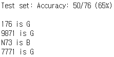
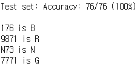

# bus_RNN
* RNN을 사용해 서울시 버스번호를 학습하여 각 버스가 어떤 유형인지 분별한다.
* dataset은 (실제 버스번호) - (label) 구조를 띈다.

| Label | 유형 |
|:---:|:---:|
| R | 급행버스 |
| G | 지선버스 |
| B | 간선버스 |
| N | 심야버스 |

* Loss ftn : Cross Entropy Loss
* Optimizer : Adam

***

| epoch | 결과 | comment |
|:---:|:---:|:---:|
| 20 |  | 버스들을 제대로 판정하지 못한다. |
| 100 |  | 실제로 존재하지 않는 버스 번호를 규칙에 맞춰 생성했을 때 제대로 판정한다.